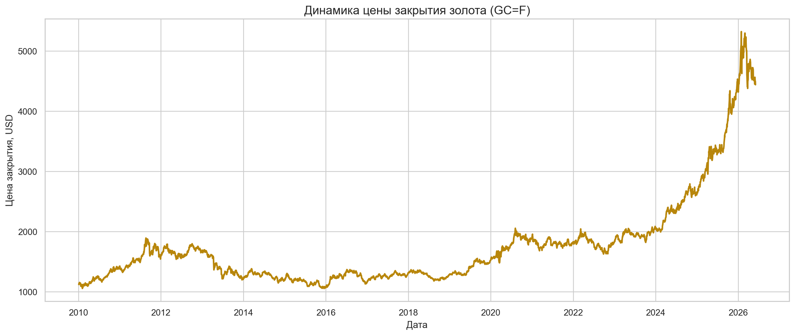
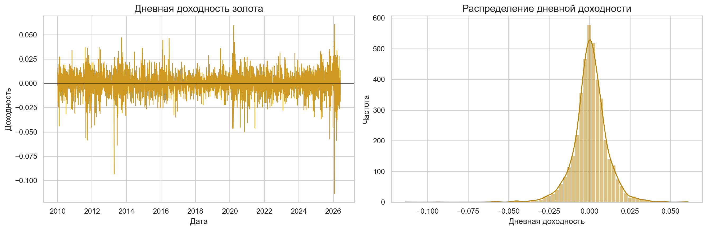
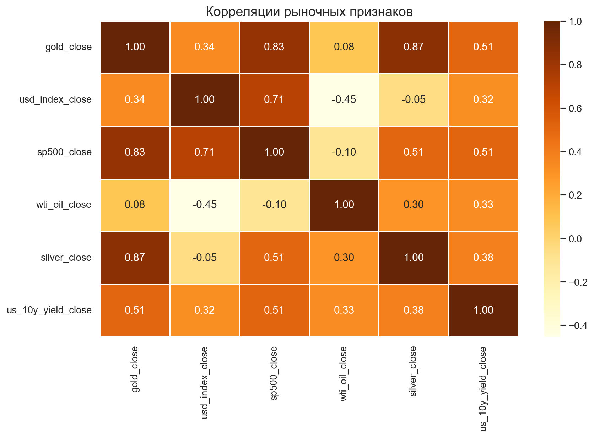
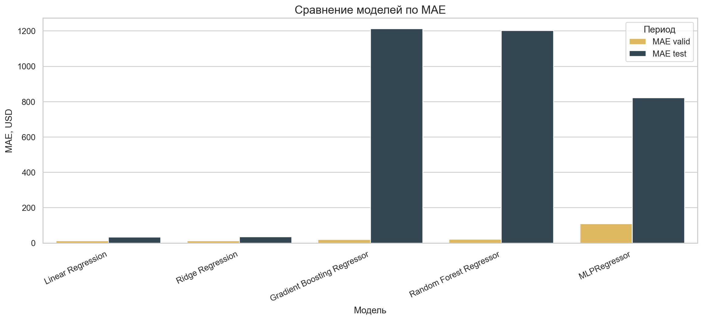
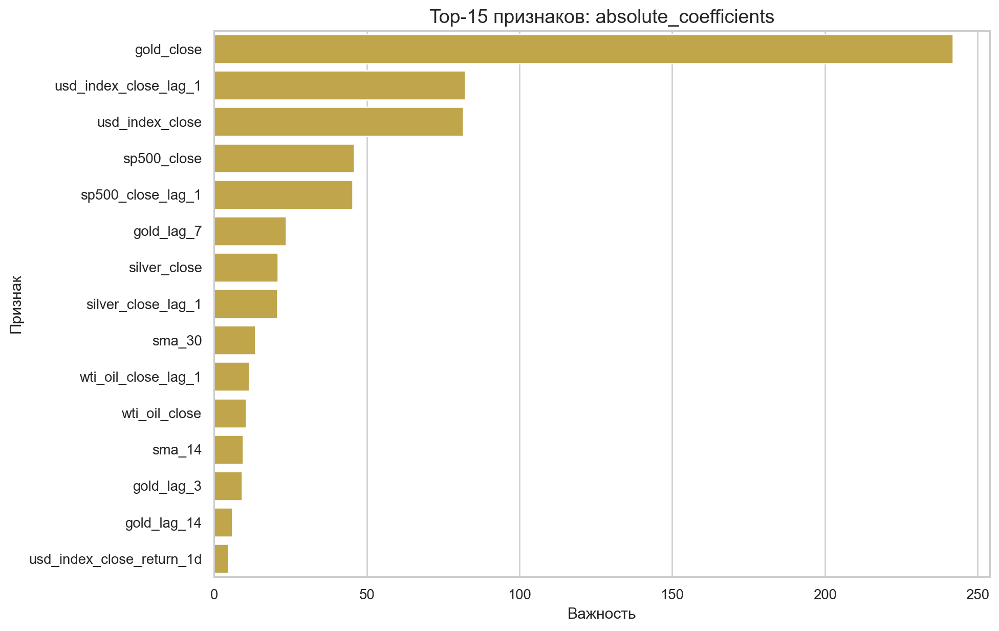
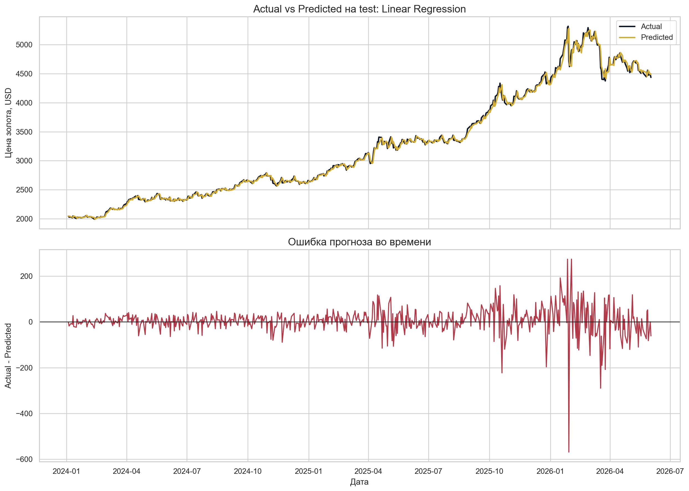
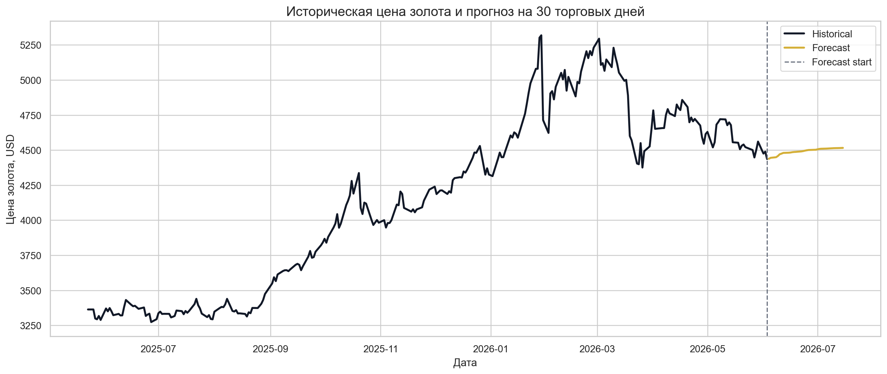

# Прогнозирование цены золота на горизонте 30 дней

Учебный AI/ML-проект для курса «Технологии искусственного интеллекта и продвинутой аналитики» магистратуры НИУ ВШЭ, программа «Бизнес-IT архитектура высокотехнологичных компаний».

## Команда

| Участник |
|---|
| Юсупов Данил |
| Панчук Павел |
| Маликов Евгений |

## Краткое описание

Проект строит воспроизводимый ML-пайплайн для прогнозирования цены закрытия золота (`GC=F`) на горизонте 30 торговых дней. В ноутбуке реализованы загрузка данных через `yfinance`, EDA, feature engineering, baseline-подходы, обучение нескольких моделей, интерпретация, сохранение артефактов и пример инференса.

## Бизнес-задача

Цена золота важна для инвесторов, банков, аналитиков, риск-менеджеров и компаний, связанных с сырьевыми рынками. Прогноз помогает оценивать рыночный риск, планировать хеджирование, отслеживать защитные активы и принимать инвестиционные решения.

## ML-формулировка

| Параметр | Значение |
|---|---|
| Тип задачи | Регрессия временного ряда |
| Целевая переменная | `target_next_day = gold_close.shift(-1)` |
| Основная метрика | MAE |
| Дополнительные метрики | RMSE, MAPE, R² |
| Горизонт прогноза | 30 торговых дней |
| Шаг прогноза | 1 день |

## Данные

Источник данных: Yahoo Finance через библиотеку `yfinance`.

| Тикер | Признак | Описание |
|---|---|---|
| `GC=F` | `gold_close` | Gold Futures |
| `DX-Y.NYB` | `usd_index_close` | индекс доллара США |
| `^GSPC` | `sp500_close` | S&P 500 |
| `CL=F` | `wti_oil_close` | нефть WTI |
| `SI=F` | `silver_close` | серебро |
| `^TNX` | `us_10y_yield_close` | доходность 10-летних облигаций США |

Фактический период данных: `2010-01-04` — `2026-06-03`. Размер датасета: `4133` строки × `6` рыночных признаков. Данные сохранены в [data/gold_market_data.csv](/Users/danilyusupov/Documents/HSE/Gold Predict ML/data/gold_market_data.csv).

## EDA

Основные графики сохранены в папке `images/`.







## Feature Engineering

В ноутбуке сформированы `38` признаков:

| Группа | Примеры |
|---|---|
| Лаги | `gold_lag_1`, `gold_lag_7`, `gold_lag_30` |
| Скользящие средние | `sma_7`, `sma_14`, `sma_30`, `sma_90` |
| Волатильность | `volatility_7`, `volatility_14`, `volatility_30` |
| Доходности | `return_1d`, `return_7d`, `return_30d` |
| Календарные признаки | день недели, месяц, квартал, год |
| Внешние рынки | доллар, S&P 500, нефть, серебро, доходность облигаций |

Разделение данных выполнено хронологически: `70%` train, `15%` validation, `15%` test. Случайное перемешивание не используется, чтобы не допустить утечку будущей информации.

## Моделирование

Сравнивались baseline-подходы и ML-модели: Linear Regression, Ridge Regression, Random Forest, Gradient Boosting, MLPRegressor. `xgboost` и `lightgbm` подключаются опционально через `try/except`; на macOS для них может потребоваться системная библиотека `libomp`.

| Model | MAE valid | RMSE valid | MAPE valid | MAE test | RMSE test | MAPE test | Training time |
|---|---:|---:|---:|---:|---:|---:|---:|
| Linear Regression | 12.94 | 17.20 | 0.70% | 34.29 | 55.51 | 0.97% | 0.003s |
| Ridge Regression | 12.95 | 17.20 | 0.70% | 34.73 | 55.82 | 0.99% | 0.001s |
| Gradient Boosting Regressor | 19.44 | 28.28 | 1.02% | 1212.05 | 1522.16 | 32.43% | 1.984s |
| Random Forest Regressor | 21.16 | 30.82 | 1.11% | 1202.78 | 1512.68 | 32.16% | 0.554s |
| MLPRegressor | 109.90 | 131.51 | 5.86% | 821.23 | 1066.51 | 21.90% | 2.836s |



## Результаты

Лучшая ML-модель по validation MAE — `Linear Regression`. На test она получила MAE `34.29` USD и MAPE `0.97%`.

Важный вывод: naive baseline оказался очень сильным и на test дал MAE `33.72` USD. Это означает, что для one-step прогноза золота простая гипотеза «завтра примерно как сегодня» почти оптимальна на текущем наборе признаков. ML-модель не превосходит naive baseline по test MAE, но превосходит moving average baseline и дает интерпретируемую структуру факторов.

## Интерпретация

Top-10 признаков лучшей модели:

| Признак | Важность |
|---|---:|
| `gold_close` | 241.998 |
| `usd_index_close_lag_1` | 82.211 |
| `usd_index_close` | 81.632 |
| `sp500_close` | 45.786 |
| `sp500_close_lag_1` | 45.415 |
| `gold_lag_7` | 23.618 |
| `silver_close` | 20.882 |
| `silver_close_lag_1` | 20.756 |
| `sma_30` | 13.545 |
| `wti_oil_close_lag_1` | 11.420 |





## Прогноз на 30 дней

Прогноз сохранен в [data/forecast_30_days.csv](/Users/danilyusupov/Documents/HSE/Gold Predict ML/data/forecast_30_days.csv). Первый прогнозный день: `2026-06-04`, цена `4437.90` USD. Последний прогнозный день: `2026-07-15`, цена `4515.62` USD.



## MLOps / Инференс

Артефакты сохранены в папке `models/`:

| Файл | Назначение |
|---|---|
| `best_model.pkl` | лучшая модель |
| `feature_columns.pkl` | список признаков |
| `feature_pipeline.pkl` | описание feature pipeline |
| `scaler.pkl` | scaler для pipeline, если используется |
| `metadata.json` | метаданные эксперимента |

Пример загрузки модели:

```python
import joblib

model = joblib.load("models/best_model.pkl")
feature_columns = joblib.load("models/feature_columns.pkl")
```

## Лендинг

В папке `landing/` находится локальное веб-приложение с backend-частью. Оно показывает результаты модели и запрашивает актуальную цену золота через локальный API.

Запуск:

```bash
node landing/app.js
```

После запуска открыть: [http://localhost:8000](http://localhost:8000)

Если порт `8000` занят:

```bash
PORT=8765 node landing/app.js
```

Приложение обновляет текущую цену золота каждые 3 минуты и при ручной перезагрузке страницы.

## Структура репозитория

```text
.
├── gold_price_forecasting.ipynb
├── README.md
├── report.md
├── requirements.txt
├── data/
│   ├── gold_market_data.csv
│   ├── baseline_results.csv
│   ├── model_results.csv
│   ├── test_predictions.csv
│   ├── feature_importance_top10.csv
│   └── forecast_30_days.csv
├── models/
│   ├── best_model.pkl
│   ├── scaler.pkl
│   ├── feature_columns.pkl
│   ├── feature_pipeline.pkl
│   └── metadata.json
├── images/
│   ├── eda_gold_price.png
│   ├── eda_returns_distribution.png
│   ├── eda_correlation_heatmap.png
│   ├── model_comparison.png
│   ├── feature_importance.png
│   └── forecast_30_days.png
└── landing/
    ├── index.html
    ├── style.css
    └── app.js
```

## Как запустить проект

```bash
python3 -m venv .venv
source .venv/bin/activate
pip install -r requirements.txt
jupyter lab gold_price_forecasting.ipynb
```

Для полного пересчета нужно удалить или обновить `data/gold_market_data.csv` либо вызвать `load_market_data(..., refresh=True)` в ноутбуке.

## Выводы и дальнейшее развитие

Проект показывает полный цикл ML-задачи: данные, EDA, признаки, baseline, модели, интерпретация, прогноз и MLOps. Главный практический вывод: для краткосрочного прогноза цены золота naive baseline очень силен, поэтому улучшение качества требует более богатых факторов и строгого backtesting.

Дальнейшие улучшения:

- добавить макроэкономические показатели и ставки ФРС;
- использовать новости и sentiment analysis;
- сделать rolling backtesting;
- протестировать ARIMA/Prophet/LSTM/TFT;
- добавить мониторинг data drift и регулярное переобучение.
